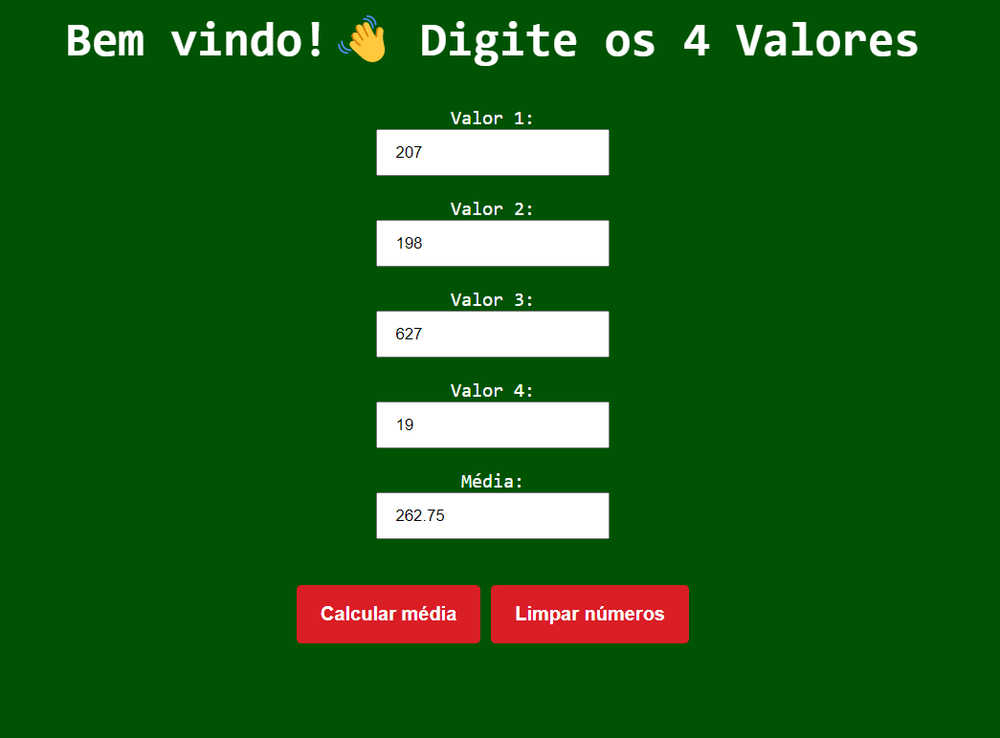

<h1 align="center"> Média de 4 Valores </h1>

Programa desenvolvido em uma atividade durante o curso de Sistemas de Informação (UFSM/FW), na matéria de Linguagem de Programação para a Web. 

  <a href="#-tecnologias">Tecnologias</a>     |    
  <a href="#-projeto">Projeto</a>     |    
  <a href="#-licença">Licença</a>

  

 

  

## 🚀 Tecnologias

Esse projeto foi desenvolvido com as seguintes tecnologias:

- HTML e CSS
- JavaScript
- Git e Github
- Visual Studio Code

## 💻 Projeto

O projeto Média de 4 Valores é uma página web que recebe 4 valores e escreve a média deles.

- [ Visite o projeto online ](https://lipeharakawa.github.io/p_w_media_4_numeros-html-css-js)

## ✅ Licença

Esse projeto está sob a licença MIT.

---

Feito com 🧡 por Felipe Seidi Harakawa 👋.
